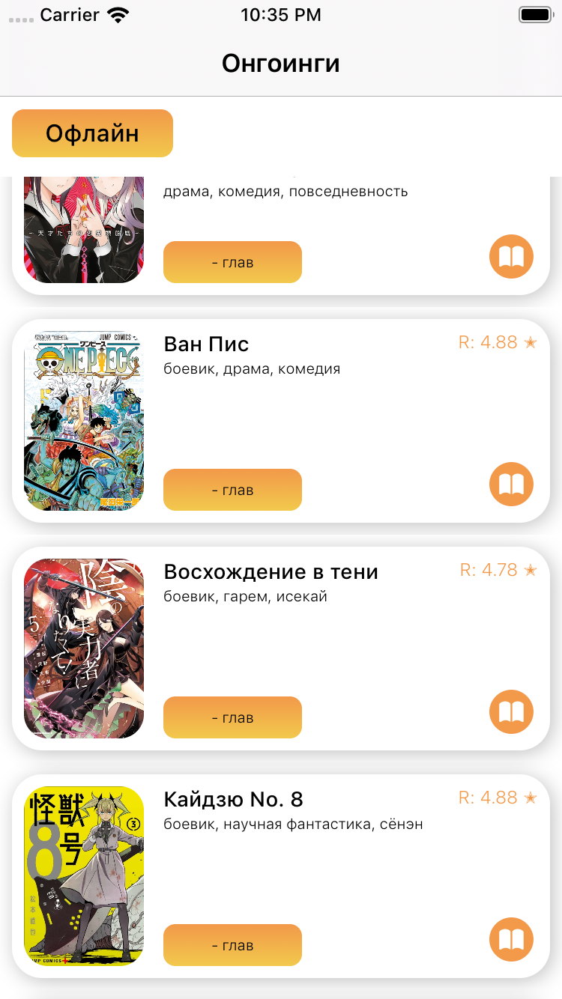

# Итоговый проект СберШколы
Это мой доведенный до ума pet-project
# Вступление
### Я хотел написать приложение, которое было бы интересно мне самому и которым я хотел бы пользоваться, а поскольку я люблю читать мангу, то выбрал именно такую тему. Никаких сторонних АПИ для того, чтобы получать мангу, а тем более ее страницы на русском нет, поэтому пришлось делать свой собстенный бэкэнд, иногда встречаются проблемы со скоростью, так что заранее прошу прощение. Если вы хотите посмотреть на то, с какой скоростью в теории все должно грузиться попробуйте загрузить 151 главу "Поднятие уровня в одиночку", все остальное грузится по настроению, либо быстро, либо медленно.

## Листы онгоингов
* ### Здесь вы можете выбрать список доступных комиксов по категории, выбрав сверху Манга, Манхва или Маньхуа

## Карточка Выбранной манги
### Здесь вы можете увидеть:
* #### Увеличенную фотографию манги
* #### Название
* #### Кнопку для открытия описания
* #### Таблицу с доступными главами

## Экран с описанием выбранной манги
* ### Здесь можно увидеть:
* #### фотографию
* #### рейтинг пользователей
* #### Количество человек участвовавшее в его формировании
* #### Описание того, что будет происходить в манге

## Экран для чтения комиксов 
* ### Здесь будут отображаться страницы выбранной вами главы

## Краткая работа приложения:

# Детали реализации
## Deployment Target: iOS 13

## Архитектура: MVC

## Сервисы:
* ### NetworkService:
#### Сервис для запросов в сеть, получения списков манги, а так же получения страниц глав.
* ### CoreDataService
#### Сервис для работы с базой данных при помощи Core Data.
* ### UserDefaultsService
#### Сервис для работы с UserDefaults, туда запоминается какая именно вкладка с категорией была открыта.
* ### JsonDataService
#### Сервис в котором находятся два менеджера, менеджер- Json Builder, который помогает собирать тела запросов, а так же менеджер, для десериализация данных полученных из интернета.
* ### ShowErrorsService:
#### Синглтон для отображения алерта с ошибками

## UserDefaults:
### Как описано выше там запоминается какая именно вкладка с категорией была открыта.

## CoreData:
### CoreData используется для офлайн режима, если у пользователя не было сети, то ему отобразятся все комиксы, которые были ему до этого отображены, если запуск был первым, то список будет пустым. Если пользователь думает, что сеть снова появилась, то он может попробовать обновить таблицу, если сеть есть он увидит лоадер, в противном случае очередной алерт об ошибке.

## Работа офлайн режима и выход из него: 

## Кастомные анимации: 
### Не знаю насколько анимированные картинки являются кастомной анимацией, но она присутствует:

## Cторонние библиотеки:
* ### SwiftLint был поставлен через HomeBrew
* ### SnapShotTesting был поставлен через SPM

## Tests:
### Unit-tests покрытие:

### UITests:

#  Note
### Уточнение по поводу бэка, дело в том, что запросы на страницы совершенные в первый раз могут происходить довольно долго, и долго происходит загрузка не самих страниц, а получение URL-ов на страницы с бэка, дело в том, что получение мною страниц происходит следующим образом: 
* Из приложения идет запрос на сервер
* Сервер идет на сторонний сервер, скачивает на устройство, где запущен сервер необходимые пользователю страницы манги
* Выгружает их на сервер 
* И передает URL-ы уже в мое приложение для возможности их загрузки
### Ниже приведена картинка для наглядности:

